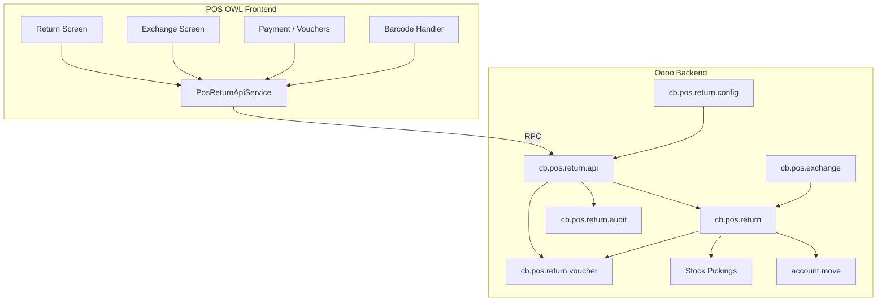

# Developer Guide

Technical reference for extending and maintaining `cb_pos_return_exchange` on Odoo 19.

---

## Architecture overview



---

## Key models

| Model | Technical name | Purpose |
|-------|----------------|---------|
| Return | `cb.pos.return` | Return header, workflow state, refund method |
| Return line | `cb.pos.return.line` | Per-line qty, disposition, amounts |
| Voucher | `cb.pos.return.voucher` | Issued credit, barcode, redemption state |
| Voucher redemption | `cb.pos.return.voucher.redemption` | Redemption audit lines |
| Exchange | `cb.pos.exchange` | Links return + replacement `pos.order` |
| Config | `cb.pos.return.config` | Company/POS policies |
| Audit | `cb.pos.return.audit` | Event log |
| API | `cb.pos.return.api` | AbstractModel — POS RPC service layer |
| Sales analysis | `cb.pos.sales.return.analysis` | SQL view for reporting |

### Return workflow states

`draft` → `confirmed` → `done` | `cancelled`

Key methods on `cb.pos.return`:

- `action_confirm()` — validation, stock moves, voucher/cash handling
- `action_done()` — finalize, issue voucher, credit note
- `action_cancel()` — cancel draft/confirmed only

### Voucher states

`issued` → `partial` → `redeemed` | `expired` | `cancelled`

---

## File layout

| Path | Role |
|------|------|
| `models/cb_pos_return.py` | Return model core |
| `models/cb_pos_return_workflow.py` | State transitions |
| `models/cb_pos_return_validation.py` | Business validation rules |
| `models/cb_pos_return_pos_api.py` | POS JSON API |
| `models/cb_pos_return_voucher_logic.py` | Issue, redeem, cancel |
| `models/cb_pos_exchange_logic.py` | Exchange + `pos_create_exchange` |
| `models/cb_pos_return_stock.py` | Picking creation |
| `models/cb_pos_return_accounting.py` | Credit notes |
| `models/cb_pos_return_receipt.py` | Receipt print actions |
| `static/src/app/services/pos_return_api_service.js` | JS RPC wrapper |
| `static/src/app/services/barcode_handler.js` | Scan routing |
| `hooks.py` | `post_init_hook` |

---

## POS frontend integration

Assets load on `point_of_sale._assets_pos`:

```python
"assets": {
    "point_of_sale._assets_pos": [
        "cb_pos_return_exchange/static/src/**/*",
    ],
},
```

### Registering screens

Return and exchange screens register POS routes in their JS modules, e.g.:

```javascript
registry.category("pos_pages").add("ReturnScreen", {
    route: `/pos/ui/${odoo.pos_config_id}/return`,
    ...
});
```

### Calling the API from JS

```javascript
const result = await this.pos.returnApi.confirmReturn({
    order_id: order.id,
    refund_method: "voucher",
    has_receipt: true,
    reason: "Wrong size",
    client_uuid: crypto.randomUUID(),  // idempotency
    lines: [
        {
            order_line_id: line.id,
            qty: 1,
            disposition: "restock",
        },
    ],
});
```

Service class: `PosReturnApiService` in `pos_return_api_service.js`.

---

## Extending the module

### Add a custom validation rule

Inherit `cb.pos.return` and override validation:

```python
from odoo import models
from odoo.exceptions import ValidationError

class CbPosReturn(models.Model):
    _inherit = "cb.pos.return"

    def _cb_validate_before_confirm(self):
        super()._cb_validate_before_confirm()
        for ret in self:
            if ret.partner_id.vip and ret.amount_total > 1000:
                raise ValidationError("VIP returns over 1000 require approval.")
```

> Hook into the actual validation method used in your installed version (`action_confirm` or `_validate_*` helpers in `cb_pos_return_validation.py`).

### Add a field to the POS settings payload

1. Add field on `cb.pos.return.config`.
2. Append to `_SETTINGS_COPY_FIELDS` and `_settings_payload()`.
3. Read it in `PosReturnApiService.getSettings()` consumers.

### Add a new report measure

Extend `cb.pos.return.report` or the SQL view in `cb_pos_sales_return_analysis.py`, then add the field to pivot/graph views.

---

## Security

- Access: `security/ir.model.access.csv`
- Record rules: `security/ir_rule.xml` (multi-company)
- Groups: `security/cb_pos_return_exchange_security.xml`

Test security changes:

```bash
python odoo-bin -c odoo19.conf -d DB --test-enable --stop-after-init \
  -u cb_pos_return_exchange --test-tags=cb_pos_return_exchange \
  --log-level=test
```

---

## Testing

### Test harness

`tests/common.py` — `CbPosReturnTestCommon` extends `odoo.addons.point_of_sale.tests.common.TestPoSCommon`.

Provides:

- POS session setup
- `_sync_order()` — create paid POS orders
- `_api_confirm()` / `_api_validate()` — API shortcuts
- `_create_return_record()` — full return flow

### Test modules

| File | Coverage |
|------|----------|
| `test_return.py` | Return workflow, cash, cancel, audit |
| `test_voucher.py` | Issue, redeem, expiry, permissions |
| `test_exchange.py` | Exchange settlement, API |
| `test_accounting.py` | Credit notes |
| `test_inventory.py` | Pickings, scrap, returnable qty |
| `test_barcode.py` | Classification, prefixes |
| `test_pos_api.py` | Settings, find order/product |
| `test_security.py` | Groups, multi-company |
| `test_performance.py` | Search/read_group benchmarks |
| `test_edge_cases.py` | Idempotency, limits, settings |

### Tags

```python
@tagged("post_install", "-at_install", "cb_pos_return_exchange")
```

---

## Receipt reports

Mixin: `cb.pos.return.receipt.mixin` (abstract)

Extensions use `_inherit = ["cb.pos.return", "cb.pos.return.receipt.mixin"]` pattern on the **same model** — do not create separate `cb.pos.return.receipt` models (causes Many2many table collisions in Odoo 19).

---

## Demo data loader

`models/cb_pos_return_demo.py` — `load_demo_data()` called from demo XML.

Uses `pos.order.sync_from_ui()` for realistic orders. Idempotent via XML ID `demo_return_voucher_done`.

---

## Debugging tips

| Symptom | Check |
|---------|-------|
| RPC returns `module_disabled` | `cb.pos.return.config.module_enabled` for company/POS |
| `permission_denied` | User groups vs required group on API method |
| M2M registry error on upgrade | Receipt classes must extend existing models, not new `_name` |
| POS assets not loading | Module upgraded? Clear browser cache |
| Stock not moved | `auto_validate_return_picking`, product `is_storable` |

Enable RPC logging:

```python
import logging
logging.getLogger("odoo.addons.cb_pos_return_exchange").setLevel(logging.DEBUG)
```

---

## Coding conventions

- API methods return `{"success": True/False, ...}` dicts — never raise to POS for business errors.
- Use `_()` for translatable strings in Python; `_t()` in JS.
- Batch reads: `search_read`, `read_group` in API layer for performance.
- Company consistency: `_check_company_auto = True` on business models.

---

## Related documentation

- [API Documentation](API.md)
- [Configuration Guide](CONFIGURATION.md)
- [Upgrade Guide](UPGRADE.md)
